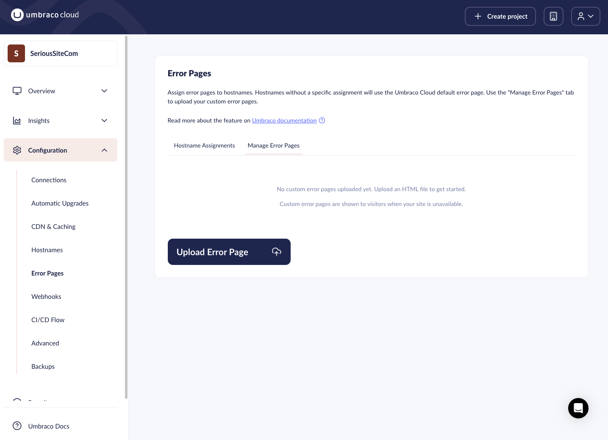
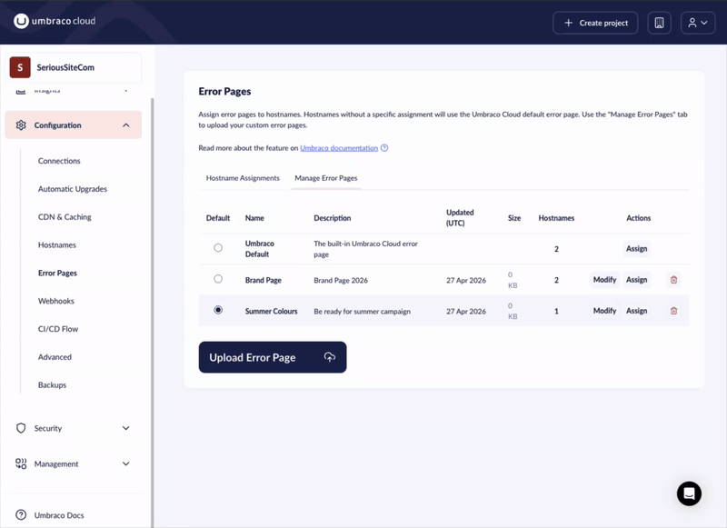
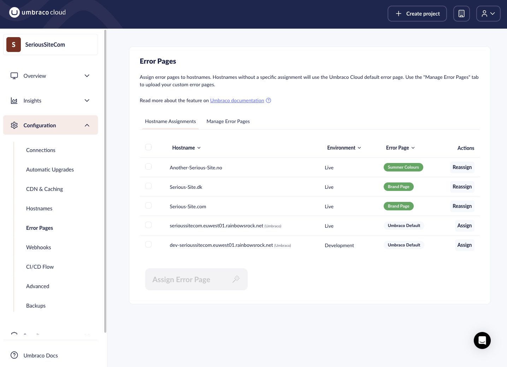

# Error Pages

The Error Pages feature lets you serve a custom HTML page to visitors when your site is unavailable due to platform operations. You can assign custom pages to all your hostnames.

Error pages are shown when an environment is restarting. Most deployments require a restart, so visitors may see the error page briefly.

To handle error pages when the website is running, see the [Umbraco CMS tutorial: Custom Error Pages](https://docs.umbraco.com/umbraco-cms/tutorials/custom-error-page).


Umbraco Cloud serves error pages via Cloudflare, directly from blob storage. When your site is down, external resources such as fonts, stylesheets, and scripts are also likely unavailable. Your error page must be entirely self-contained — see [Error Page Authoring guidelines](#error-page-authoring-guidelines) for details.

You need Admin or Write access to upload, manage and assign error pages. Users with read-only access can view the tabs but cannot make changes.


You manage the feature from two tabs: **Managing Error Pages** and **Hostname Assignments**.

## Managing Error Pages

This tab lists all uploaded custom HTML pages and the built-in Umbraco Cloud Default. The **Hostnames** row shows a count of how many hostnames are currently assigned to that page.




### Upload a page

1. Click **Upload Error Page**.
2. Enter a name for the page.
3. Optionally enter a description.
4. Select an `.html` or `.htm` file (max **20 KB**).
5. Click **Upload** to confirm.



### Default

Click on one of the empty radio buttons next to any uploaded page. That page becomes the fallback for all new hostnames. The active default is selected in the **Default** column.

### Modify

Click on any uploaded page to open the detail dialog. The dialog has three tabs:

- **Preview** — shows the HTML content as formatted code.
- **Edit** — update the display name and description without touching the file.
- **Replace** — upload a new file version. Hostnames already assigned to this page continue using it after the replacement — no reassignment needed.

### Assign

Click **Assign** to open the assign dialog and bulk-assign that error page to one or more hostnames.

### Delete

Click the delete icon on a row to remove the page. If the page was assigned to any hostnames, those hostnames revert to the Umbraco Cloud error page.

## Hostname Assignments

This tab shows every hostname across all environments and which error page it currently uses.



### Filter the list

Use the column header dropdowns to filter by:

- **Environment** — show only hostnames from a specific environment.
- **Error Page** — show only hostnames using a specific page, or those using the default.
- **Domain** — filter by registrable domain (for example `mysite.co.uk`).
- **Top-level domain (TLD)** — filter by top-level domain (for example `.co.uk`).

Click **Reset filters** to clear all active filters.

### Assign to a single hostname

Click the assign icon on a hostname row, select a page from the dropdown, and confirm.

### Bulk assign

1. Check the checkboxes next to the hostnames you want to update.
2. Use **Select all** to pick all hostnames currently shown.
3. Click **Assign**.
4. Choose a page from the dropdown and confirm.

### Revert to default

In the assign dialog, select **Use default (remove custom assignment)**. The hostname falls back to the Umbraco Cloud error page.

## Error Page Authoring Guidelines

Keep these requirements in mind when building a custom error page:

- **Max file size**: 20 KB (HTML, CSS, and JS combined)
- Only `.html` or `.htm` files are accepted
- Error pages must be **self-contained** — no external resources (see below)

**Why self-contained?** Cloudflare serves your error page directly from blob storage. When your site is unavailable, external fonts, stylesheets, and scripts (Google Fonts, CDN libraries, and so on) are likely to fail too. Without those resources, the error page appears broken or unstyled. Everything must be inline.

- Inline all CSS in a `<style>` block.
- Inline all JavaScript in a `<script>` block.
- Use system fonts instead of web fonts: `font-family: -apple-system, BlinkMacSystemFont, 'Segoe UI', sans-serif`.
- Inline any icons as SVG markup rather than loading an icon library.

### Recommended meta tags

```html
<head>
  <meta name="robots" content="noindex, nofollow">
  <meta http-equiv="Cache-Control" content="no-cache">
</head>
```

The `robots` tag prevents search engines from indexing your error page. The `Cache-Control` tag prevents browsers from caching the error page, so visitors get a fresh load once your site recovers.

### Reload mechanism

Tell visitors what is happening and give them a way back.

**Auto-poll (recommended)** — Use JavaScript to periodically send a `HEAD` request to the current URL and reload automatically when the site responds with `200`. Use exponential back-off with jitter to avoid hammering the server, and show a manual refresh button after a set number of failed attempts:

```javascript
var MAX_ATTEMPTS = 20;
var attempt = 0;

function getDelay(n) {
  var base   = Math.min(5000 * Math.pow(2, n - 1), 60000);
  var jitter = base * 0.1 * (Math.random() * 2 - 1);
  return Math.round(base + jitter);
}

function poll() {
  attempt++;
  fetch(location.href + '?_poll=' + Date.now(), { method: 'HEAD', cache: 'no-store' })
    .then(function(res) {
      if (res.ok) { location.reload(); return; }
      scheduleNext();
    })
    .catch(scheduleNext);
}

function scheduleNext() {
  if (attempt >= MAX_ATTEMPTS) {
    document.getElementById('refresh-btn').style.display = 'inline-block';
    return;
  }
  setTimeout(poll, getDelay(attempt));
}

setTimeout(poll, 5000); // first check after 5 s
```

**Fallback** — Always include a manual "Refresh page" button for visitors without JavaScript, or once polling is exhausted:

```html
<button id="refresh-btn" onclick="location.reload()" style="display:none">Refresh page</button>
<noscript><button onclick="location.reload()">Refresh page</button></noscript>
```

### Complete template

The following is a self-contained starting point that combines all the guidelines above. Adjust the heading, message, and styles to suit your site.

```html
<!DOCTYPE html>
<html lang="en">
<head>
  <meta charset="UTF-8">
  <meta name="viewport" content="width=device-width, initial-scale=1.0">
  <meta name="robots" content="noindex, nofollow">
  <meta http-equiv="Cache-Control" content="no-cache">
  <title>Site Unavailable</title>
  <style>
    *, *::before, *::after { box-sizing: border-box; margin: 0; padding: 0; }

    body {
      font-family: -apple-system, BlinkMacSystemFont, 'Segoe UI', sans-serif;
      background: #f2f2f2;
      color: #333;
      display: flex;
      align-items: center;
      justify-content: center;
      min-height: 100vh;
      padding: 1rem;
    }

    .card {
      background: #fff;
      border: 1px solid #ddd;
      border-radius: 6px;
      max-width: 480px;
      width: 100%;
      padding: 2.5rem 2rem;
      text-align: center;
    }

    h1 { font-size: 1.25rem; font-weight: 600; margin-bottom: 0.75rem; }

    p { font-size: 0.95rem; line-height: 1.6; color: #555; margin-bottom: 1.5rem; }

    button {
      background: #333;
      color: #fff;
      border: none;
      border-radius: 4px;
      cursor: pointer;
      font-size: 0.9rem;
      padding: 0.6rem 1.25rem;
    }

    button:hover { background: #555; }
  </style>
</head>
<body>
  <div class="card">
    <h1>We'll be right back</h1>
    <p>This site is temporarily unavailable. We are working on it and will be back shortly.</p>
    <button id="refresh-btn" onclick="location.reload()" style="display:none">Refresh page</button>
    <noscript><button onclick="location.reload()">Refresh page</button></noscript>
  </div>
  <script>
    var MAX_ATTEMPTS = 20;
    var attempt = 0;

    function getDelay(n) {
      var base   = Math.min(5000 * Math.pow(2, n - 1), 60000);
      var jitter = base * 0.1 * (Math.random() * 2 - 1);
      return Math.round(base + jitter);
    }

    function poll() {
      attempt++;
      fetch(location.href + '?_poll=' + Date.now(), { method: 'HEAD', cache: 'no-store' })
        .then(function(res) {
          if (res.ok) { location.reload(); return; }
          scheduleNext();
        })
        .catch(scheduleNext);
    }

    function scheduleNext() {
      if (attempt >= MAX_ATTEMPTS) {
        document.getElementById('refresh-btn').style.display = 'inline-block';
        return;
      }
      setTimeout(poll, getDelay(attempt));
    }

    setTimeout(poll, 5000); // first check after 5 s
  </script>
</body>
</html>
```
